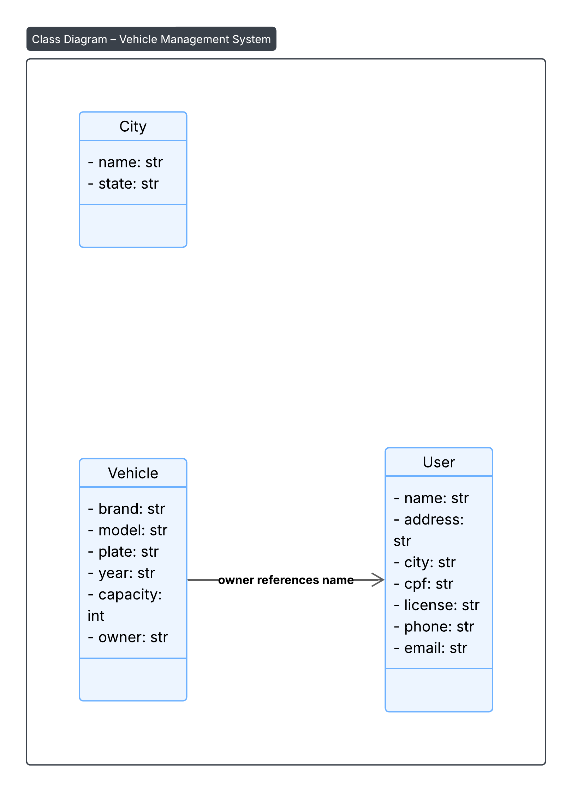

# 🚗 Sistema de Cadastro de Usuários, Veículos e Cidades

Este projeto é um sistema desktop desenvolvido em **Python**, com interface gráfica usando **Tkinter** e persistência de dados com **SQLite**. A aplicação permite o cadastro de usuários, veículos e cidades, armazenando todas as informações localmente em um banco de dados relacional.

O sistema foi criado para fins didáticos, com foco no aprendizado de manipulação de banco de dados, organização de interface gráfica e lógica de entrada de dados em aplicações desktop.

---

##  Funcionalidades

-  **Cadastro de cidades:** Nome e UF
-  **Cadastro de usuários:** Nome, CPF, endereço, cidade, habilitação, telefone e e-mail
-  **Cadastro de veículos:** Marca, modelo, placa, ano, capacidade e proprietário
-  Banco de dados local gerado automaticamente
-  Interface gráfica com janelas separadas para cada tipo de cadastro

---

## Interface

O sistema apresenta uma **janela principal** com três botões principais:
- `Usuário` → Abre a janela de cadastro de usuários
- `Veículo` → Abre a janela de cadastro de veículos
- `Cidade` → Abre a janela de cadastro de cidades

Cada janela utiliza o padrão `Toplevel()` para manter a aplicação modular e organizada.

---
## Diagrama de classe

## 💻 Tecnologias Utilizadas

| Ferramentas  | Finalidade                                       |
|--------------|--------------------------------------------------|
| **Python 3** | Linguagem principal de desenvolvimento           |
| **Tkinter**  | Interface gráfica do usuário (GUI)               |
| **SQLite**   | Banco de dados local integrado à aplicação       |
| **ttk**      | Componentes visuais adicionais para a GUI        |

---
